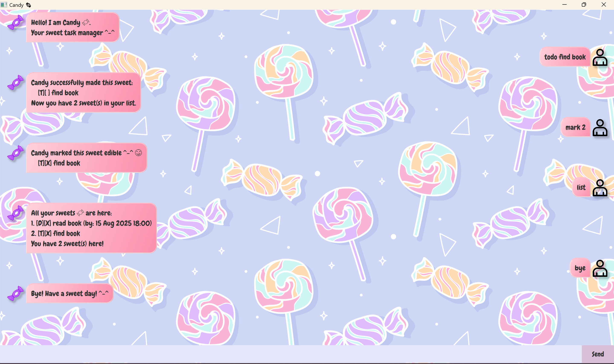

# Candy 🍬 User Guide

## Welcome to Candy chatbot!
>Manage your ~~tasks~~ **sweets** here!

After opening the app, you will see the welcome line!

Type your command in the input box below and start
managing your ~~tasks~~ sweets!

## Command guides:

### 1. Adding todo tasks

Type `todo <task>`
to add your todo task!

Type:
`todo read book `

and Candy will show you this:
```
Candy successfully made this sweet:       
    [T][ ] read book
    Now you have 1 sweets in your list.
```

### 2. Adding deadlines

Type `deadline <task> /by <dd-mm-YYYY HHmm`
to add your deadline task!

*pss if you are feeling lazy, type: 
`deadline <task> /<dd-mm-YYYY HHmm>`*

Type one of the following:
1: `deadline read book /by 15-08-2025 1800`
2: `deadline read book /15-08-2025 1800`

Candy will show you this:
```
Candy successfully made this sweet:       
    [D][ ] read book (by: 15 Aug 2025 18:00)
    Now you have 2 sweets in your list.
```

### 3. Adding events

Type 
`event <task> /from <dd-mm-YYYY HHmm> /to <dd-mm-YYYY HHmm`
to add your event task!

*pss if you are feeling lazy, type:
`event <task> /<dd-mm-YYYY HHmm> /<dd-mm-YYYY HHmm>`*

Type one of the following:
1: `event read book /from 15-08-2025 1800 /to 18-08-2025 1800`
2: `event read book /15-08-2025 1800 /18-08-2025 1800`

Candy will show you this:
```
Candy successfully made this sweet:       
    [E][ ] read book (from: 15 Aug 2025 18:00 to: 18 Aug 2025 18:00)
    Now you have 3 sweets in your list.
```

### 4. Marking task
Want to keep track of completed task?

Type `mark <task number>`
to mark your task!

For example, type:
`mark 1`

Candy will show you this:
```
Candy has ate this sweet ^-^ 😋
    [T][X] read book
```

### 5. Unmark task
Marked wrongly?

Type `unmark <task number>`
to unmark your task!

For example, type:
`unmark 1`

Candy will show you this:
```
Candy has spat out this sweet ^-^ 😝
    [T][ ] read book
```

### 6. Delete task
Don't want the task anymore?

Type `delete <task number>`
to delete your task!

For example, type:
`delete 1`

Candy will show you this:
```
Candy threw away this sweet 😋
    [T][X] read book
    Now you have 2 sweets left
```

### 7. List task
Unsure of task number?

Type `list`!

Candy will show you your list of task:
```
All your sweets 🍬 are here:
    1. [D][ ] read book (by: 15 Aug 2025 18:00)
    2. [E][ ] read book (from: 15 Aug 2025 18:00 to: 18 Aug 2025 18:00)

```

### 8. Find task
Want to find specific tasks?

Type `find <keyword>`!

For example, type:
`find book`

Candy will show you this:
```
Candy found these sweets 🍬 !
    1. [D][ ] read book (by: 15 Aug 2025 18:00)
    2. [E][ ] read book (from: 15 Aug 2025 18:00 to: 18 Aug 2025 18:00)

```

### 9. Edit task
Typed wrongly? Want to change the details?

Type 
`edit <task number> /<task> <start time if any> <end time if any>!`

For example, type:
`edit 1 /return book /by 20-08-2025 2359`

Candy will show you this:
```
Candy has remade this sweet:
    [D][X] return book (by: 20 Aug 2025 23:59)
```

### 10. Exit
Done with the chat?

Type `bye`

Candy will say goodbye and close the chat!
```
Bye! Have a sweet day ^-^
```

